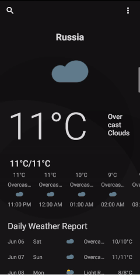

# Weather-Search
Weather forecast information via searching the location or by selecting the current location.

<ul>
<li>Mvvm pattern.</li>
<li>Xaml DataBinding </li>
<li>Xamarin Essentials for Geolocation</li>
<li>Openweather API webservices.</li>
<li>Background process async/await. </li>
<li>Appsettings for persistence </li>

</ul>

